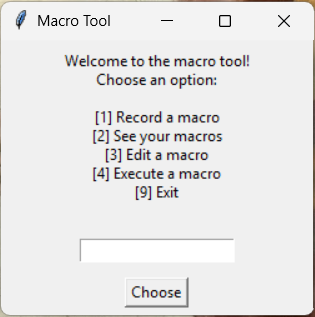
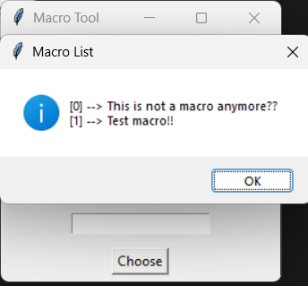
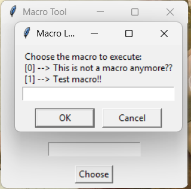
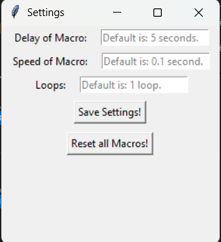
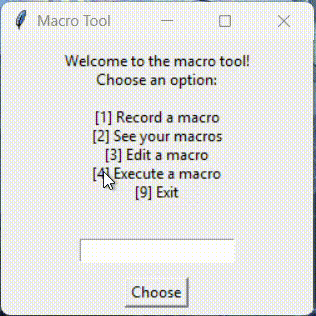

# Keyboard Macro Tool

A simple Python GUI application for creating and executing keyboard macros to automate repetitive typing tasks.

## Features

-  **Record text macros** - Save frequently used text sentences
-  **View all macros** - See your entire macro list
-  **Edit macros** - Update existing macros
-  **Execute macros** - Automatically type saved text with a 5-second delay
-  **Settings Windows** - Allows the edit of Macro Speed, Loops and Delay
-  **Delete Macros** - Allows the deletion of macro via individual indexes, or full wipe of list 
-  **Persistent storage** - Macros saved to JSON file
-  **Clean GUI** - Simple tkinter interface

## Screenshots

### MAIN PAGE


### MACRO LIST


### MACRO EXECUTE WINDOW


### MACRO SETTINGS WINDOWS


### MACRO IN ACTION


## Requirements

- Python 3.x
- pynput library
- tkinter
### OR
- python3-tk (on Ubuntu)

## Installation

### Option 1: Download executable (Windows only)

Download the latest `.exe` from the [Releases](https://github.com/Tsuzas/macro-tool/releases) page.

### Option 2: Run from source

1. Clone this repository:
```bash
git clone https://github.com/Tsuzas/macro-tool.git
cd macro-tool
```

2. Install dependencies:
```bash
pip install pynput
# tkinter comes with Python (no installation required)
# or in Linux ubuntu
sudo apt install python3-tk
```

3. Run the application:
```bash
python KeyRecUI.py
```


## Usage

1. **Record a macro**: Choose option [1], type your text, and click "Add Macro"
2. **View macros**: Choose option [2] to see all saved macros
3. **Edit a macro**: Choose option [3], select a macro and modify its content
4. **Execute a macro**: Choose option [4], select which macro to type, then switch to your target window within 5 seconds, or allow listener and execute it whenever you want
5. **Alter Settings**: Choose option [8], allows the change of macro Speed, loops, or delay
6. **Delete Macros**: Choose option [5], allows the deletion of a macro via its index, or wipe the list in settings that is in option [8].

## How It Works

The tool stores your text macros in a `sentences.json` file and uses the `pynput` library to simulate keyboard input when executing macros, allow listener to be able to execute the macro whenever you want, or not, and it will automatically execute within the written delay.

## Future Plans

-  Mouse macro support ( clicks, movements )
-  Special key combinations ( Ctrl, Alt, etc. )

## License

This project is not licensed – see the LICENSE file for details or check https://unlicense.org/.

## Author

[Fernando Pereira] - [Tsuzas]
